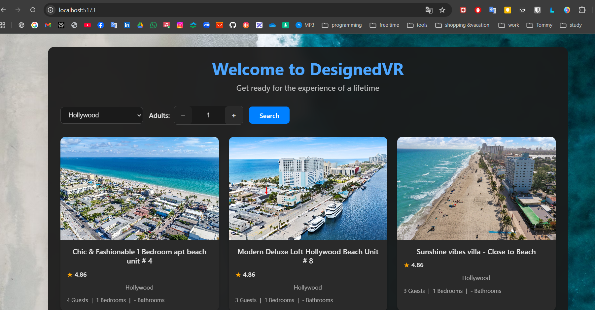

## 🏨 BoomNow Hotel Search

Full-stack demo for searching BoomNow hotels. FastAPI backend proxies BoomNow APIs, Vue frontend provides a simple search widget.

---

### 🚀 Backend Setup
1. `cd backend`
2. Create virtualenv (optional): `python -m venv .venv && .\.venv\Scripts\activate`
3. Install deps: `pip install -r requirements.txt`
4. Run main app

---

### 🌐 Frontend Setup
1. `cd frontend`
2. Install deps: `npm install`
3. Dev server: `npm run dev`
4. Open `http://localhost:5173/`

---

### 🔌 API Overview
- `GET /api/health` → BoomNow status (calls `/open_api/v1/status`)
- `GET /api/search?city=TLV&adults=2` → forwards to BoomNow `/open_api/v1/search`

Auth tokens are cached in `BoomNowAuth` with expiry buffer; credentials fetched from env.

---

### 🧪 Quick Test
```bash
curl "http://127.0.0.1:8000/api/search?city=Tel%20Aviv&adults=2"
```

---

### 🧱 Tech Stack
- FastAPI + httpx async client
- Vue 3 + 


